# 

<div align="center">

### Systems engineer building secure, intelligent Python infrastructure

[](https://nileaditya.github.io)
[](https://nileaditya.github.io/experiments)
[](https://nileaditya.github.io/systems)

</div>

---

## `$ whoami`

I architect systems where **security**, **intelligence**, and **clean design** converge. Python is my primary instrument—not just for writing code, but for building reliable, scalable infrastructure that thinks ahead.

My approach: **fundamentals-first engineering** augmented by AI, never replaced by it. Every system I build respects the constraints of production, the realities of scale, and the non-negotiables of security.

```python
class Engineer:
    def __init__(self):
        self.mindset = ["systems_thinker", "security_aware", "ai_assisted"]
        self.principles = ["clean_architecture", "test_driven", "production_ready"]
        self.stack = ["python", "cybersecurity", "ml_ops"]
    
    def build(self, problem):
        return self.analyze(problem) \
                   .design_with_constraints() \
                   .implement_with_tests() \
                   .deploy_with_confidence()
```

---

## `$ cat current_state.log`

### **Building**
- **Secure Python applications** with cryptographic primitives
- **Cybersecurity utilities** for vulnerability assessment and hardening
- **AI-assisted development tools** that enhance, not automate away, engineering
- **Computer vision & steganography** projects exploring hidden information systems

### **Learning**
- Data structures & algorithms (fundamentals never expire)
- Advanced Python internals & performance optimization
- ML with scikit-learn (understanding before frameworks)
- Backend scalability patterns & distributed systems
- Production engineering: observability, resilience, deployment

### **Seeking Collaboration**
- Open-source Python libraries with real-world impact
- AI/ML systems that solve tangible problems
- Backend APIs & microservices architecture
- Security tools & penetration testing frameworks

---

## `$ ls -la skills/`

<div align="center">


</div>

---

## `$ python -m system_metrics`

<div align="center">


</div>

---

## `$ grep -r "philosophy" ./mindset/`

### **Engineering Principles**

**Respect constraints.** GitHub doesn't execute JavaScript in READMEs. Good. Constraints breed creativity. This profile uses SVG animation, semantic HTML, and strategic visual design—not hacks.

**Build for production.** Every project considers scalability, observability, and failure modes from day one. Local demos are starting points, not destinations.

**Security is not optional.** From input validation to cryptographic implementation, security is embedded in the design phase, not audited afterward.

**AI assists, humans architect.** LLMs accelerate iteration. They don't replace understanding systems, debugging edge cases, or making architectural decisions.

---

## `$ curl -X GET https://nileaditya.github.io`

<div align="center">

### **The full engineering interface lives beyond this README**

[](https://nileaditya.github.io)

*Interactive dashboards • Project architectures • System diagrams • Terminal interface*

</div>

---

## `$ echo $CONTACT`

<div align="center">

[](https://github.com/nileaditya)
[](mailto:your.email@example.com)
[](https://linkedin.com/in/yourprofile)

</div>

---

<div align="center">

```
┌────────────────────────────────────────────────────────────┐
│  "The best engineers build systems that outlive their code" │
└────────────────────────────────────────────────────────────┘
```


</div>
